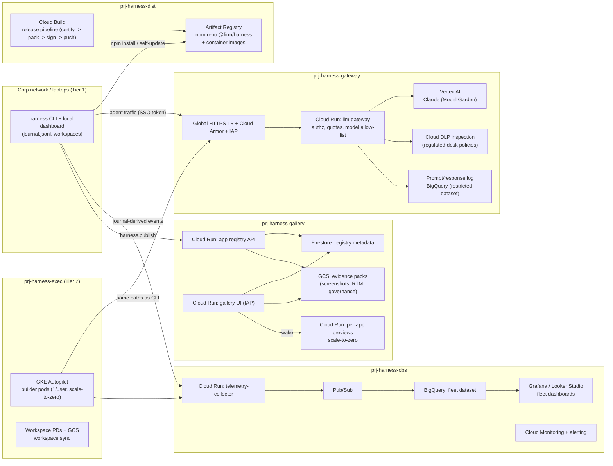
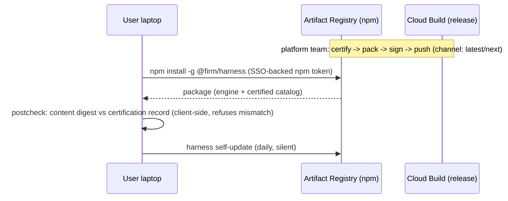
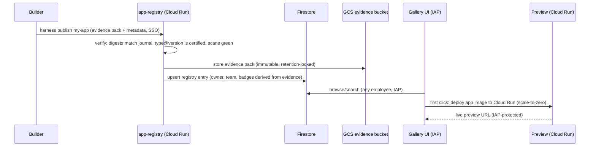
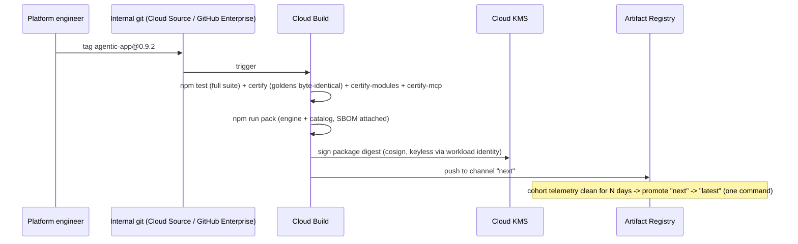

# GCP Deployment Architecture

Concrete deployment design for the [50k rollout plan](ROLLOUT.md) on Google
Cloud. The four planes (distribution, execution, evidence, showcase) map to
small, mostly serverless GCP footprints; Claude runs through **Vertex AI**
(Anthropic models on Model Garden) so agent traffic never leaves the firm's
cloud perimeter.

- [1. Project & environment topology](#1-project--environment-topology)
- [2. Component architecture](#2-component-architecture)
- [3. Dataflow diagrams](#3-dataflow-diagrams)
- [4. Network design & egress matrix](#4-network-design--egress-matrix)
- [5. Identity & access](#5-identity--access)
- [6. Security controls](#6-security-controls)
- [7. Infra component inventory](#7-infra-component-inventory)
- [8. IaC & release engineering](#8-iac--release-engineering)
- [9. Sizing & cost](#9-sizing--cost)

---

## 1. Project & environment topology

One GCP organization folder per concern; blast radius and IAM boundaries follow
project lines. Everything exists in `dev` / `staging` / `prod` variants except
the org-level security projects.

```
org: firm.example
└── folder: harness/
    ├── prj-harness-dist-{env}       Distribution: Artifact Registry (npm + containers), release Cloud Build
    ├── prj-harness-gateway-{env}    LLM gateway: Cloud Run proxy -> Vertex AI, DLP, prompt logs
    ├── prj-harness-exec-{env}       Tier-2 hosted builders: GKE Autopilot, workspace storage
    ├── prj-harness-obs-{env}        Telemetry: collector, Pub/Sub, BigQuery, dashboards
    ├── prj-harness-gallery-{env}    Showcase: app registry, gallery, preview runtime
    └── prj-harness-sec              Org security: KMS keyrings, SCC, audit log sinks (no env split)
```

**Regions:** primary `us-east4`, DR `us-central1`. All services regional; BigQuery
and GCS multi-region `US`. Vertex AI region chosen by model availability with
the gateway hiding the region from clients.

**VPC-SC:** one service perimeter around `{gateway, exec, obs, gallery}` prod
projects — Vertex AI, BigQuery, GCS, Firestore inside the perimeter; access via
Access Context Manager levels (corp devices + workforce identity only).

## 2. Component architecture



Key decisions:

- **Vertex AI, not the public Anthropic API.** Claude via Model Garden keeps
  prompts inside the org + VPC-SC perimeter, bills to firm projects, and gives
  per-model IAM. The gateway sets `ANTHROPIC_VERTEX_PROJECT_ID`-style routing
  server-side; clients only ever see the gateway URL.
- **Cloud Run for every service** (gateway, collector, registry, gallery,
  previews): scale-to-zero matches the bursty profile; per-revision rollback
  matches the channel model.
- **GKE Autopilot only for Tier-2 builders** — the one long-running,
  stateful-ish workload (a build can run 1–2h with park/resume). One pod per
  active builder, persistent disk per user workspace, scale-to-zero via
  autoscaler; pods are the same container image the release pipeline certifies.
- **Firestore + GCS for the registry** — metadata is small and document-shaped;
  evidence packs are immutable blobs (GCS with retention lock = audit-friendly).

## 3. Dataflow diagrams

### DF-1: Install / update



Egress needed: laptop → Artifact Registry only. No github.com, no registry.npmjs.org.

### DF-2: Live build (agent traffic)

```mermaid
sequenceDiagram
  participant H as harness CLI (envelope)
  participant GW as llm-gateway (Cloud Run)
  participant DLP as Cloud DLP
  participant V as Vertex AI (Claude)
  participant BQ as prompt log (BigQuery)
  H->>H: node starts: budget gate, stage attempt dir
  H->>GW: POST /v1/messages (SSO OIDC token, run-id, node-id headers)
  GW->>GW: authz (workforce id), quota check (user/team), model allow-list
  GW->>DLP: inspect (policy per desk: PII/MNPI detectors)
  GW->>V: forward to Claude on Vertex (region-pinned)
  V-->>GW: stream response
  GW->>BQ: log prompt+response refs, tokens, cost, run-id (restricted dataset)
  GW-->>H: stream response
  H->>H: validate -> verify -> commit; cost.json written to journal
```

The run-id / node-id headers make **gateway logs joinable with fleet
telemetry** — cost seen by the gateway reconciles against cost recorded in
journals (drift = tampering signal).

### DF-3: Telemetry

```mermaid
sequenceDiagram
  participant H as harness CLI / builder pod
  participant C as telemetry-collector (Cloud Run)
  participant PS as Pub/Sub
  participant BQ as BigQuery fleet dataset
  participant G as Grafana / Looker
  H->>H: run events appended to ~/.harness/telemetry.jsonl (offline buffer)
  H->>C: batched POST (async, never blocks a build; retry w/ backoff)
  C->>PS: publish (schema-validated envelope)
  PS->>BQ: BQ subscription (streaming insert)
  BQ->>G: fleet dashboards (reliability / cost / adoption / quality)
  BQ->>BQ: scheduled queries: cohort rollups per type@version, budget-block alerts
```

### DF-4: Publish & showcase



### DF-5: Release (platform team)



## 4. Network design & egress matrix

**Shared VPC** in a host project; service projects (`gateway`, `exec`, `obs`,
`gallery`) attach. No public IPs anywhere: all Cloud Run services behind the
global HTTPS LB with **IAP**; GKE private cluster; **Private Google Access** +
**Private Service Connect** endpoints for Google APIs; **Cloud NAT** only in
`exec` (builder pods fetching from mirrors); **Cloud Armor** on the LB (geo +
rate + WAF rules).

Egress matrix — the complete list of allowed flows (everything else denied by
VPC firewall / egress policy / corp proxy):

| # | Source | Destination | Protocol | Purpose | Control point |
|---|--------|-------------|----------|---------|---------------|
| E1 | Laptop (corp) | `harness.pkg.firm` → Artifact Registry | HTTPS 443 | install / self-update | corp proxy allow-list + AR IAM |
| E2 | Laptop (corp) | `llm.firm` → LB → llm-gateway | HTTPS 443 (SSE) | agent traffic | IAP (workforce SSO) + gateway authz |
| E3 | Laptop (corp) | `telemetry.firm` → collector | HTTPS 443 | fleet events | IAP service account / OIDC |
| E4 | Laptop (corp) | `gallery.firm` → registry/gallery | HTTPS 443 | publish, browse | IAP |
| E5 | Laptop (corp) | `mirror.pypi.firm`, `mirror.npm.firm` (Artifactory/AR remote repos) | HTTPS 443 | uv/npm resolution for generated apps | corp proxy + mirror allow-list |
| E6 | llm-gateway | Vertex AI regional endpoint | HTTPS 443 | model calls | PSC endpoint inside perimeter, SA-scoped IAM |
| E7 | Builder pod (GKE) | E2, E3, E4, E5 equivalents | HTTPS 443 | same as laptop | egress NetworkPolicy + Cloud NAT + proxy |
| E8 | Preview Cloud Run | *(none)* | — | previews are egress-null; apps run with stub/gateway-only agent mode | serverless VPC connector w/ deny-all egress |
| E9 | Collector | Pub/Sub / BigQuery | Google APIs | pipeline | PSC + VPC-SC |
| E10 | Cloud Build | AR, KMS, git | Google APIs / HTTPS | release | workload identity, no static keys |

**Explicitly blocked everywhere:** `api.anthropic.com`, `registry.npmjs.org`,
`pypi.org`, `github.com` (except the platform team's release runners),
arbitrary internet from builder pods and previews. Laptop enforcement is the
corp proxy; cloud enforcement is VPC firewall + VPC-SC + NetworkPolicies.

**DNS:** internal zones `*.firm` (Cloud DNS private zones + corp DNS
forwarding) so client config is stable across regions/failover: `llm.firm`,
`telemetry.firm`, `gallery.firm`, `pkg.firm`.

## 5. Identity & access

| Principal | Identity | Access |
|---|---|---|
| Builders (50k) | Workforce Identity Federation (corp IdP → Google) | IAP to gateway/telemetry/gallery; AR read on npm repo; no direct GCP project access |
| Regulated-desk builders | Same + access level `regulated` | Routed to Tier-2 builders; stricter DLP policy templates on the gateway |
| Platform team | Google groups → IAM roles | `roles/run.admin` etc. per project, breakglass via PAM; release rights only through Cloud Build triggers |
| Audit / risk | Group `harness-audit` | Read-only: gallery, evidence GCS, BigQuery authorized views (no raw prompt log without joint approval) |
| Services | Dedicated SAs + Workload Identity | Least privilege per arrow in the component diagram; zero SA keys exported |
| Gateway → Vertex | SA `sa-llm-gateway` | `roles/aiplatform.user` on allowed models only |

Quota/chargeback identity: the gateway resolves workforce identity → HR
team/cost-center via a nightly-synced lookup (BigQuery), stamped onto every
prompt-log and telemetry row.

## 6. Security controls

- **VPC Service Controls** perimeter around prod data services (Vertex,
  BigQuery, GCS, Firestore) — exfiltration to out-of-perimeter projects fails
  even with stolen credentials.
- **CMEK everywhere** (KMS keyring in `prj-harness-sec`): AR, GCS evidence,
  BigQuery datasets, PDs, Pub/Sub. Key rotation 90d; separate keys per plane.
- **Binary Authorization** on GKE + Cloud Run: only Cloud-Build-attested images
  (signed provenance) run; the builder image and preview base image are the
  only admitted lineages.
- **Package signing:** release digests signed via KMS (cosign); the CLI's
  existing digest check extends to signature verification on install.
- **DLP:** gateway inspects prompts/responses with per-desk policy templates
  (MNPI, PII infoTypes); regulated desks get block-mode, others audit-mode.
- **Prompt/response log** is its own restricted BigQuery dataset: 30d default
  retention, authorized-view access, joint security+legal approval workflow
  for raw reads.
- **Cloud Armor:** WAF preconfigured rules + per-identity rate limits in front
  of every public-facing LB path.
- **Security Command Center Premium** org-wide; findings for the harness
  folder routed to the platform team's queue.
- **Audit logging:** Admin Activity + Data Access logs on all harness projects
  → org log sink → the firm's SIEM (immutable GCS + Chronicle/equivalent).
- **Evidence immutability:** GCS bucket retention lock on evidence packs —
  published proof cannot be quietly edited; republish creates a new version.
- **Preview isolation:** published apps run scale-to-zero with deny-all
  egress, IAP-only ingress, `HARNESS_AGENT_MODE=stub` by default (live-agent
  previews opt in through the gateway with the app owner's quota).

## 7. Infra component inventory

| Component | GCP service | Env | HA/DR | Notes |
|---|---|---|---|---|
| npm + container registry | Artifact Registry | dev/stg/prod | multi-region replicas | channels = npm dist-tags (`latest`/`next`) |
| Release pipeline | Cloud Build (private pool) | prod | regional | runs full test suite + certification on every tag |
| LLM gateway | Cloud Run (min 1, max ~200 inst) | dev/stg/prod | multi-region + LB failover | stateless; config via Secret Manager |
| Model serving | Vertex AI (Claude, Model Garden) | prod | multi-region routing in gateway | provisioned throughput for peak hours (evaluate at Phase C) |
| DLP inspection | Cloud DLP | prod | managed | policy templates per desk tier |
| Prompt log | BigQuery (restricted dataset) | prod | multi-region US | 30d retention, CMEK |
| Tier-2 builders | GKE Autopilot (private) | stg/prod | regional cluster | 1 pod/user active; PD-SSD workspace per user; scale-to-zero |
| Workspace archive | GCS (nearline after 30d) | prod | multi-region | park/resume across builder restarts |
| Telemetry collector | Cloud Run | dev/stg/prod | multi-region | schema-validated; Pub/Sub dead-letter for malformed |
| Event bus | Pub/Sub | prod | global | BQ subscription (no Dataflow needed at this volume) |
| Fleet dataset | BigQuery | prod | multi-region US | partitioned by day, clustered by type@version |
| Dashboards | Grafana on Cloud Run (or Looker Studio) | prod | stateless | reads BQ via SA |
| Alerting | Cloud Monitoring | all | managed | SLOs: gateway p99, collector loss rate, build completion cohort dips |
| App registry API | Cloud Run + Firestore | prod | multi-region Firestore | verify-on-publish logic here |
| Evidence store | GCS (retention-locked) | prod | multi-region | immutable packs |
| Gallery UI | Cloud Run + IAP | prod | multi-region | the storefront, firm-wide |
| App previews | Cloud Run (one service/app) | prod | scale-to-zero | sleep/wake; deny-all egress |
| Keys | Cloud KMS (`prj-harness-sec`) | org | multi-region keyring | CMEK + signing keys |
| Perimeter | VPC-SC + Access Context Manager | org | — | corp-device + workforce-identity access levels |

## 8. IaC & release engineering

```
infra/                        (new repo or top-level dir; Terraform, state in GCS + state lock)
  modules/
    project-baseline/         APIs, CMEK wiring, log sinks, budget alerts
    run-service/              Cloud Run + LB serverless NEG + IAP + Armor policy
    gke-builders/             Autopilot cluster, node egress policy, workspace PD classes
    telemetry-pipeline/       collector + Pub/Sub + BQ dataset + scheduled queries
    gallery/                  registry, Firestore, evidence bucket (retention), preview deployer
    gateway/                  proxy service, DLP templates, Vertex IAM, prompt-log dataset
  envs/
    dev/  staging/  prod/     tfvars + perimeter membership per env
```

- **Promotion:** terraform plan/apply per env via Cloud Build with manual
  approval gate into prod; no console mutations (drift detection alerts).
- **App releases** (the certified catalog) ride DF-5, independent of infra
  releases. The two pipelines share only Artifact Registry.
- **Preview deployer:** the gallery's "wake" path uses a dedicated SA that can
  deploy only images built by the trusted pipeline (Binary Authorization
  enforces this even if the SA is misused).
- **DR:** everything stateless redeploys from IaC; stateful stores (BQ, GCS,
  Firestore, AR) are multi-region by default. RTO ≈ LB failover for the
  gateway (minutes); RPO ≈ 0 for evidence/telemetry (streamed).

## 9. Sizing & cost

Planning numbers for steady state at 50k seats (Phase D), ~20% monthly-active
builders, ~10k live builds/month, p50 ≈ $110/complex build (observed):

| Line | Est. monthly | Basis |
|---|---|---|
| Vertex AI (Claude) | ~$90–120k | 10k builds × p50, held down by envelopes/memoization/replay-first onboarding; the dominant cost — everything else is noise |
| llm-gateway Cloud Run | $1–2k | streaming proxy, ~10–30 rps peak |
| GKE builders (Tier 2, ~500 concurrent peak) | $8–15k | Autopilot pods 4vCPU/8GB active-hours only + PD |
| BigQuery (fleet + prompt log) | $2–4k | streaming inserts + queries; partitioned/clustered |
| Pub/Sub, GCS, Firestore, AR | $1–3k | evidence packs dominate GCS growth (~1–5MB/build) |
| LB, Armor, IAP, DLP, KMS, monitoring | $2–4k | DLP metered on regulated-desk traffic only |
| **Total infra (non-model)** | **~$15–30k/mo** | ≪ model spend, as intended |

Cost guardrails wired into the platform (not just billing alerts): certified
budget envelopes cap per-build spend; gateway quotas cap per-user/team spend;
BigQuery scheduled queries reconcile gateway-metered vs journal-recorded cost
daily and alert on drift; project-level budget alerts are the backstop.

---

*Sequencing note: this architecture deploys incrementally along the
[ROLLOUT.md](ROLLOUT.md) phases — Phase A needs only `dist` + `gateway` + a
minimal collector; `gallery` and Tier-2 builders arrive in Phase B; VPC-SC
hardening and provisioned throughput are Phase C concerns.*
